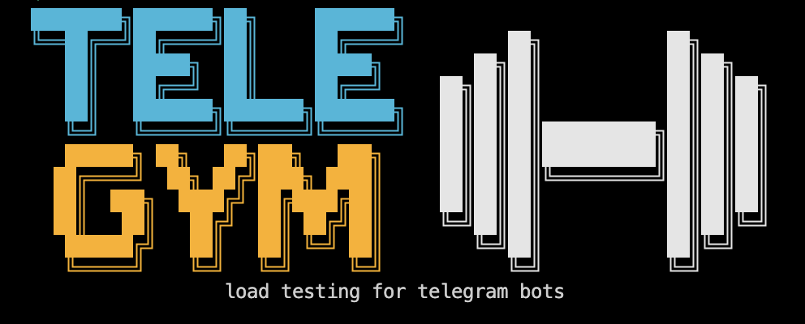

# telegym · load testing for telegram bots (mock + proxy + k6)

[](https://github.com/kolomiichenko/telegym/actions/workflows/ci.yml)
[](https://pkg.go.dev/github.com/kolomiichenko/telegym)
[](https://goreportcard.com/report/github.com/kolomiichenko/telegym)
[](https://github.com/kolomiichenko/telegym/blob/main/go.mod)
[](https://core.telegram.org/bots/api)
[](https://opensource.org/licenses/MIT)
[](https://github.com/kolomiichenko/telegym/releases)
[](https://deepwiki.com/kolomiichenko/telegym)

<p align="center"></p>

Universal load-testing kit for Telegram bots. Drop-in mock of the Telegram Bot
API plus a k6 extension for writing virtual-user scenarios. Works with any bot
implementation regardless of language - the mock speaks plain HTTP, the bot
points at it via `TELEGRAM_API_URL`.

## Why

- **telegram-test-api** (Node.js) is great for functional smoke tests but not
  designed for thousands of concurrent virtual users.
- **Test DC + Telethon/Pyrogram** uses real Telegram infrastructure - accurate
  but expensive: every virtual user is a real MTProto session, and the test
  DC throttles aggressively above a few hundred clients.
- **k6** is the industry-standard load runner but speaks HTTP, not Bot API.

telegym bridges the gap: a fast Go mock that looks like Bot API to your bot,
plus an `xk6` extension so k6 scenarios can drive virtual Telegram users.

## Architecture

```
  k6 scenario  ──► xk6-telegym ──► /debug/inject/update ──► telegym-mock
                                                              │
                                                              ▼
                                                  POST <bot_webhook_url>
                                                              │
                                                              ▼
                                                         your bot
                                                              │
                                                              ▼
                                                  POST telegym-mock/bot<token>/sendMessage
                                                              │
                                                              ▼
                                                  stored in telegym-mock.botMessages
                                                              │
                                                              ▼
                                       xk6.awaitButton ◄── GET /debug/botMessages
```

## Prerequisites

- **Go 1.26+** - install from <https://go.dev/dl/> (exact version is pinned in `go.mod`)
- **make** - preinstalled on macOS with Xcode CLI tools (`xcode-select --install`), `apt install make` on Debian/Ubuntu
- *(optional)* **Docker + Docker Compose** - only needed for `make grafana-up` (Prometheus + Grafana dashboards)

All other tools - `xk6` for the custom k6 build, the k6 binary itself, golangci-lint, govulncheck, etc. - are either installed on demand by the relevant `make` targets or are purely optional.

## Quickstart

```bash
# Optional one-time setup: copies .env.example -> .env and pre-fetches modules.
# Skippable - defaults are compiled in and `go build` will fetch deps anyway.
make init

# Build the mock, proxy, demo echobot, and a custom k6 with the xk6-telegym
# extension. The k6 build takes ~13s the first time (xk6 assembles it).
make build build-examples

# Smoke test the full stack against the bundled echobot example
./examples/echobot/run.sh

# Output:
#   checks_total.......: 10440   258.85/s
#   checks_succeeded...: 100.00% 10440 out of 10440
#   ✓ welcome arrived
#   ✓ welcome under 500ms
#   ...
```

For your own bot, point it at the mock and write a scenario:

```bash
export TELEGRAM_API_URL=http://localhost:5678
export TELEGRAM_TOKEN=1234567890:telegym_default_mock_token_xxxxxxxx
./your-bot                                   # bot calls setWebhook automatically

./bin/k6 run path/to/your-scenario.js
```

## Configuration

All binaries are configured via environment variables - no config files, no
required flags. Defaults work out of the box; override only what you need.
The complete reference (grouped by binary, with comments on each variable)
lives in [`.env.example`](.env.example). `make init` copies it to `.env`
if you want a persistent local config.

## Repo layout

```
cmd/telegym-mock/   Mock Bot API server entry point
cmd/telegym-proxy/  Real-Telegram to mock relay
pkg/mock/           Mock as a library (HTTP handlers, store, webhook dispatch)
pkg/xk6/            k6 extension exposing `tg` API to JS scenarios (own go.mod)
examples/echobot/   Self-contained demo bot + k6 scenarios + run.sh
docker/             docker-compose stack (Prometheus + Grafana)
docs/               Project assets (banner, screenshots)
```

The repo is a Go workspace (`go.work`) containing two modules: the root module
for the mock server, and `pkg/xk6` for the k6 extension (kept separate so the
mock binary doesn't drag in the entire k6 dep tree).

## Scenario API

JS scenarios import the extension as `k6/x/telegym` and get a default export
exposing `newUser()`:

```js
import tg from 'k6/x/telegym';

const u = tg.newUser(0);             // 0 = auto-allocate chat ID per VU
u.send('/start');                    // inject a text message
const m = u.awaitText('^Welcome', 5); // wait up to 5s for matching reply
u.click('age_verify');               // inject a callback query
```

Returned `Message` objects expose `.text`, `.replyMarkup`, `.latencyMs`, and a
`.findButton(pattern)` helper for extracting specific buttons.

## User pools (two-phase scenarios)

For scenarios where one run registers users and a later run replays them
(e.g. register-then-play), telegym follows the standard k6 pattern: an NDJSON
file on disk, read via `SharedArray` so it loads once and is shared across
all VUs.

**Phase 1 - register** uses the only file-write helper the extension provides
(k6 itself doesn't allow file writes from VUs):

```js
import tg from 'k6/x/telegym';

export default function () {
  const u = tg.newUser(0);
  // ... run the registration flow ...
  tg.appendUser('./data/users.ndjson', u, {
    tags: ['registered', 'uk'],
    attrs: { country: 'UA' },
  });
}
```

**Phase 2 - replay** is plain k6 + the tiny `parsePool` helper:

```js
import tg from 'k6/x/telegym';
import { parsePool, pickUser } from './_lib/pool.js';

// open() is k6 built-in, path is relative to this scenario file.
const users = parsePool(open('../data/users.ndjson'));

export default function () {
  const d = pickUser(users, 'vu');     // 'vu' | 'iter' | 'random'
  const u = tg.newUser(d.chat_id);
  // ... play as that user ...
}
```

Env knobs for subset selection (no code changes needed):

| Var | Effect |
|---|---|
| `TAG=foo` | only records that include tag "foo" |
| `OFFSET=200 LIMIT=200` | use records 200-399 |
| `SHUFFLE=1` | shuffle once at run start |

```bash
# Different ways to consume the same pool:
LIMIT=200 ./bin/k6 run path/to/play.js                  # first 200
OFFSET=200 LIMIT=200 ./bin/k6 run path/to/play.js       # next 200
TAG=vip ./bin/k6 run path/to/play.js                    # only VIPs
SHUFFLE=1 LIMIT=200 ./bin/k6 run path/to/play.js        # random 200
```

**Path convention:** scenarios live in `examples/echobot/scenarios/`; the data folder is one
level up. Writes go through `tg.appendUser('./data/...')` (process-CWD
relative - k6 is launched from repo root). Reads use `open('../data/...')`
(k6 resolves relative to the scenario file). Different strings, same file.

## Bot API coverage

All 176 Bot API methods are accepted and return shape-valid JSON. Coverage
breaks down in two layers:

- **Explicit handlers** (15 methods) for the ones with real side effects:
  send/edit messages and media land in the outbound store (queryable via
  `/debug/messages`), `setWebhook` registers the delivery URL, `getMe`
  returns a stable identity per token, etc.
- **Spec-driven generic dispatcher** for the remaining 161 methods. It loads
  an embedded `api.json` (from
  [PaulSonOfLars/telegram-bot-api-spec](https://github.com/PaulSonOfLars/telegram-bot-api-spec))
  and synthesises a zero-value response of the declared return type. So
  `getChat → Chat`, `forwardMessage → Message`, `copyMessage → MessageId`,
  `createChatInviteLink → ChatInviteLink`, `getStickerSet → StickerSet`, etc.
  all parse cleanly in any Bot API client.

Refresh the spec when Telegram releases a new Bot API version:

```bash
make refresh-spec
```

## Real-user modes

Two ways to drive the bot manually, both running alongside a load test.

### A. HTMX debug chat (browser, no real Telegram)

Self-contained chat UI served by the mock itself:

```bash
make mock-up         # start the mock (uses your own bot pointed at TELEGRAM_API_URL)
make debug-chat      # open http://localhost:5678/debug/chat in the browser
# ...
make mock-down       # when done
```

Pick any chat_id, start typing. The page polls the mock for new bot
replies once per second and renders inline keyboards as real clickable
buttons. htmx.min.js is embedded in the binary - no CDN.

### B. Real-Telegram relay (`telegym-proxy`)

Use a real Telegram client (mobile, desktop) to talk to the
bot-under-test through a throwaway proxy bot. Native stickers, formatting,
inline buttons, attachments.

```bash
# 1. Create a bot via @BotFather, copy its token
export PROXY_TOKEN=12345:abc...

# 2. Run mock + echobot + telegym-proxy
make proxy-up
# make proxy-down  to stop

# 3. Open @your_proxy_bot in Telegram - every message you send is relayed
#    to the bot-under-test, every reply comes back through real Telegram.
```

Optional: `export ALLOWED_USER_ID=<your-id>` to restrict who can talk to
the proxy bot.

How it works:
- telegym-proxy long-polls real Telegram for messages addressed to the proxy bot
- Each user message → `POST /debug/inject/update` on the mock using the
  real user's chat_id, so the bot-under-test sees you as a normal user
- The proxy registers itself with the mock as the forward target for that
  chat_id; when the bot sends an outbound message, the mock POSTs it to
  the proxy's `/forward` endpoint
- The proxy fetches any referenced media bytes from `/debug/files/:file_id`
  (captured from the bot's multipart uploads) and calls the real Bot API
  to deliver to you

Limitations of v1: stickers sent by `file_id` are rendered as `[sticker]`
text in the real chat (the proxy bot doesn't own those file_ids). Photos,
videos, and animations the bot uploads from disk are forwarded with real
bytes. Edits via mock message_ids are tracked through a per-process
mapping so the bot's `editMessageText` propagates correctly.

## Metrics & dashboards

Three signal sources, all landing in a single Prometheus and one Grafana
dashboard:

| Source | What | Method |
|---|---|---|
| telegym-mock | RPS by Bot API method, request latency, webhook dispatch lag, file store size, proxy bindings | scrape `:9104/metrics` |
| k6 | VU count, iteration rate, check pass rate, HTTP request duration p50/p95/p99 | k6 remote-write → Prometheus receiver |
| bot-under-test | whatever you already export | scrape your existing endpoint |

```bash
# 1. Bring up the Prometheus + Grafana stack
make grafana-up
#    Prometheus:  http://localhost:9090
#    Grafana:     http://localhost:3000  (anonymous admin; auto-loads telegym dashboard)

# 2. Run a scenario that pushes to Prometheus while the mock scrapes itself
make scenario-prom
```

The dashboard `telegym.json` is auto-provisioned and shows k6 and mock
signals on the same timeline so you can correlate ramp-ups in load with
backend latency. Add a third scrape target in `docker/prometheus.yml`
to overlay your bot's metrics.

## Status

Bootstrap complete. The kit covers mock + xk6 + pool persistence +
HTMX chat + real-Telegram relay + Prometheus / Grafana flow.
Future: HTMX SSE updates instead of polling, sticker file_id round-trip
in telegym-proxy, k6 cloud distributed mode.

## License

MIT.
